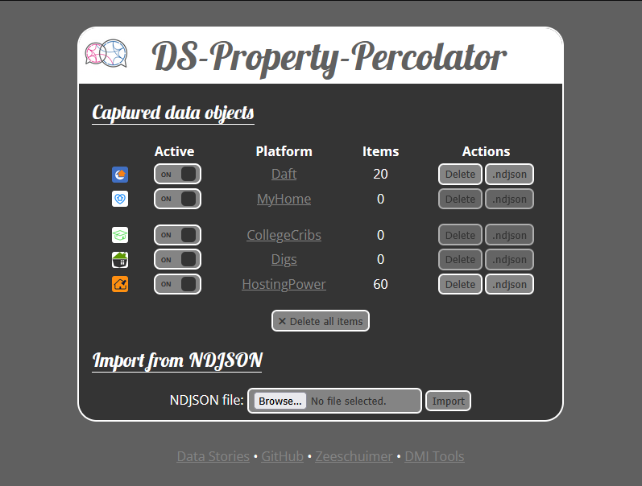

# DS-Property-Percolator

The Data Stories Property Percolator is a browser extension designed for researchers investigating planning, property and housing data in Ireland at a local level. The extension is a fork of [Zeeschuimer](https://github.com/digitalmethodsinitiative/zeeschuimer), a browser extension that monitors internet traffic while you are browsing a social media website and collects data about the items you see in a platform's web interface for later analysis.

The extension does not interfere with your normal browsing and never uploads data automatically. It uses the
[WebRequest](https://developer.mozilla.org/en-US/docs/Mozilla/Add-ons/WebExtensions/API/webRequest) browser API to
locally collect and parse the data that platforms send to your browser as you use them. **Each platform module is a purely passive parser and only processes data that your browser has already fetched as part of normal browsing. It never sends requests of its own to any platform or external service.** Data can be exported as an NDJSON file and integrated into your own analysis pipeline.

Currently, it supports the following platforms:

- [Daft](https://www.daft.ie/)
- [MyHome](https://www.myhome.ie/)
- [College Cribs](https://www.collegecribs.ie/)
- [Digs](https://www.digs.ie/)
- [Hosting Power](https://www.hostingpower.ie/)

## Installation

1. Download and install [Firefox](https://www.mozilla.org/firefox/) if you don't already have it.
2. Go to the [DS-Property-Percolator releases page](https://github.com/virtualarchitectures/DS-Property-Percolator/releases), find the latest release and click the `.xpi` file to download it. Alternatively, you can right-click it and select **Save Link As...**.
3. Install the downloaded `.xpi`:
    - Clicking the `.xpi` file should prompt Firefox to install it automatically.
    - Alternatively, you can try dragging and dropping the `.xpi` file onto the browser window to install it.
    - Finally, if neither of the above methods work, open Firefox, type `about:addons` in the browser navigation bar, click the gear icon, select **Install Add-on From File...**, and select the downloaded `.xpi` file. Then click **Add** when prompted.

## How to use

1. Click the extension icon in the Firefox toolbar to open the interface. If it is not visible, look for the Extensions icon (a puzzle piece) and pin it to the toolbar.
2. Enable capturing for the platforms you want to collect data from.
3. Browse a supported platform's site. The item count will increase as data is collected.
4. When you have the data you need yu can export it as a CSV or NDJSON file.

The CSV files are useful for analysis while the NDJSON files can be stored and loaded back into the extension if you want to add to the same dataset in your next browsing session. 

It is always best practice to refresh a page after you toggle collection on for a supported platform's site in the DS-Property-Percolator control panel.

If you find you you are getting incompatible data from different parts of the same website, try organising your captures by activating/deactiating collection between different parts of the site, and exporting data before moving on. 

## Limitations

Due to technical limitations, it may not be possible to collect all items from all 'views' for each supported platform. Data capture may break or change based on platform changes. Always cross-reference captured data with what you are seeing in your browser.

## Ethical Considerations

Bellingcat have previously reviewed Zeeschuimer for the purposes of OSINT research and investigative journalism and have provider useful guidance on ethical considerations regarding it's use: [Bellingcat's Online Investigation Toolkit - Zeeschuimer](https://bellingcat.gitbook.io/toolkit/more/all-tools/zeeschuimer)

In particular Bellingcat highlight the following issues which are also worth considering in relation to research into planning, property and housing data:

> **Terms of Service Compliance:** Capturing data by simulating normal browsing likely violates the spirit (if not letter) of some platforms’ terms of service. While you are only recording what you can already see, some platforms forbid any automated data collection. There is a gray area here: Zeeschuimer isn’t a bot scraping hundreds of pages per minute – it’s you scrolling – but you should still be mindful that using the data outside the platform (especially for publication) might contravene platform policies. Journalists should weigh the public interest of the investigation against these terms and possibly seek guidance if unsure.
>
> **Privacy of Content:** Consider the privacy implications for the people whose posts you collect. Even if content is “public” on a social media platform, individuals might not expect their posts to be aggregated and analyzed by third parties. If you plan to publish any data or findings, think about anonymizing personal data (usernames, etc.) or focusing on aggregate insights. For example, collecting posts from private groups or accounts (which you have access to) is especially sensitive – you have the right to see it as a member, but sharing that data further could invade privacy.
>
> **Bias and Algorithmic Personalization:** Zeeschuimer captures a personalized view of social media. This means the dataset you collect is influenced by your account’s history, your social graph, or other personalization factors (especially on platforms like TikTok, where the For You feed varies by user). Ethically, you should acknowledge this if you use the data in analysis: it’s your algorithmic bubble. One way to mitigate this is to use fresh or burner accounts with minimal personalization, or multiple accounts from different perspectives, to collect comparative data. Be transparent in your reporting about how the data was collected and its potential biases.
>
> **Data Security:** The extension stores data locally in your browser until you export it. Ensure that once you export data (particularly if it contains sensitive or personal content), you handle it securely. If you upload to 4CAT or any cloud service, be aware of that service’s security measures: you wouldn’t want a leaked dataset to expose individuals in ways that could cause harm. Also, if working on sensitive investigations, consider the operational security of using your own account or device to browse (you might use a sock-puppet account or a separate browser profile to avoid linking research activity to your personal identity).
>
> **Use in Reporting:** When publishing findings from Zeeschuimer collections, clearly explain how you obtained and analyzed the material so others can assess and, where appropriate, replicate your work. If you illustrate a point with a single post, include a faithful capture of what was visible at the time of collection with date, time, and URL; for broader claims drawn from many posts, summarize your methodology, including time window, selection criteria, and limitations. Where reporting could feed accountability processes, preserve an unaltered evidentiary copy, and maintain logs and metadata; work from separate working copies. If disclosing full technical details would create safety, legal, or ethical risks, state that certain steps are withheld for justified reasons while retaining internal documentation. Make clear that the findings come from an open‑source collection via a browser extension rather than an official dataset.
>
> In summary, Zeeschuimer empowers you to gather data in situations where the platforms themselves don’t provide easy access. Use that power responsibly: respect user privacy as much as possible, be aware of biases in the data, and operate within legal/ethical bounds for your jurisdiction and profession. When in doubt, consult with an editor or a legal advisor, especially if dealing with large-scale personal data.

### Platform-Specific Terms of Service

The Data Stories extension only records content that the site sends to the user's browser while the they browse the site at a normal, human reading pace. The extension does not send automated requests or crawl pages independently. However, neither platform's terms recognise this as a meaningful distinction. **Potential users should review the current terms of each platform before attempting to collect data, and seek appropriate guidance before publishing findings.**

## Development and Testing

1. Clone the respoitory.
2. Open the Firefox browser.
3. Navigate to `about:debugging#/runtime/this-firefox` in your browser.
4. Click "This Firefox"
5. Click "Load Temporary Add-on"
6. Select the manifest.json file from your extension directory

## Releasing a New Version

1. Update the `"version"` field in `manifest.json`.
2. Run `./create-zip.sh` to build the release artifacts. The script patches the version string in the interface and produces `release/DS-Property-Percolator-v<version>.zip` and `.xpi`.
3. Commit the changes.
4. Tag the commit and push: `git tag v<version> && git push && git push --tags`.
5. On GitHub, go to **Releases → Draft a new release**, select the tag, write release notes, and attach both files from the `release/` directory.

## Credits & license

DS-Property-Percolator is a fork of Zeeschuimer, originally developed by Stijn Peeters for the [Digital Methods Initiative](https://digitalmethods.net). Both are licensed under the Mozilla Public License, 2.0. Refer to the LICENSE file for more information.

Interface icons by [Font Awesome](https://fontawesome.com/license/free).
[Open Sans](https://fonts.google.com/specimen/Open+Sans) and [Lobster](https://fonts.google.com/specimen/Lobster) fonts from Google Fonts.
